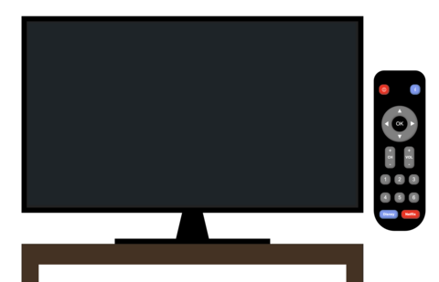
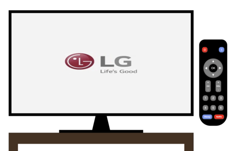
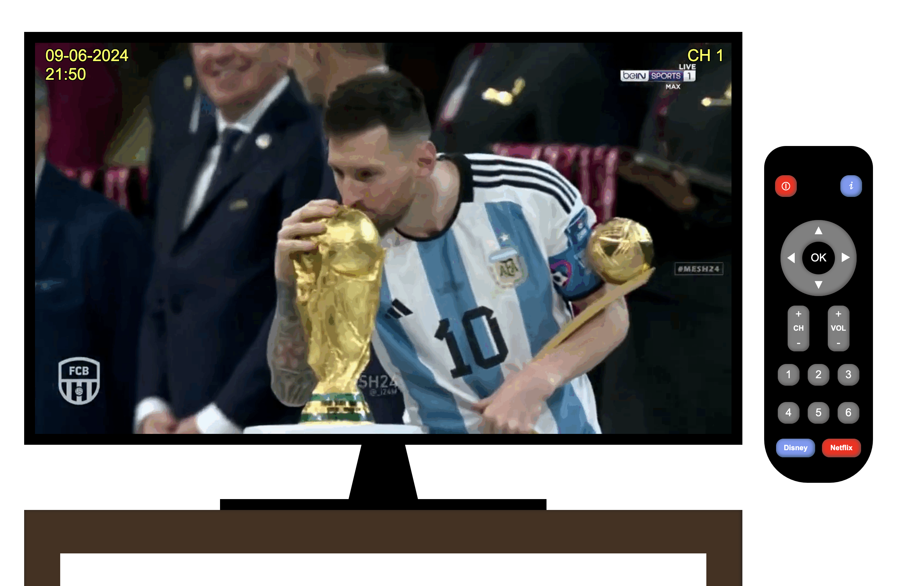
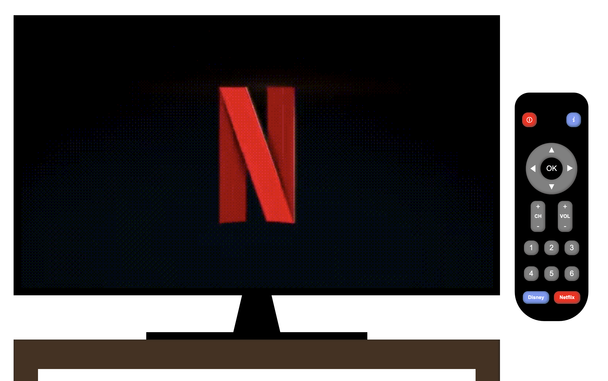

# :tv: My Interactive TV - Televisión Interactiva

## 📖 Descripción
**My Interactive TV** como su nombre lo indica, simula una televisión y un mando a distancia interactivos, permitiendo cambiar de canal, encender/apagar la TV, mostrar información y acceder a servicios de streaming como Netflix y Disney+.

## 🌟 Características
- **Encender y apagar la TV:** Con el botón rojo On - Off.
- **Cambiar de canales** Con el teclado numérico o a través del botón CH.
- **Mostrar y ocultar información de la TV:** A través del botón "info", señalado con una "i", se puede acceder a la fecha, hora y nombre del canal actual.
- **Acceder a canales de streaming como Disney + y Netflix:** Mediante sus respectivos botones.

## 🔮 Futuras funcionalidades
- **Menú:** Permitirá acceder a diferentes opciones y deslizar a través de ellas con la rueda.
- **Videos:** Los gifs serán reemplazados por videos y tendrán sonido.
- **Volumen:** Permitirá que, al pulsar el botón VOL + o - suba o baje el volumen respectivamente, mostrando en pantalla una barra indicativa.
- **Transiciones:** Al encender la TV, la pantalla principal se verá unos segundos y luego cambiará al canal 1. Al cambiar entre canales y al apagar la TV, habrá transiciones para hacer la experiencia más realista.
- **Luces led:** Se añadirá tanto a la TV como al mando, una luz led que indique si está encendido/apagado y que parpadee al cambiar de canales.
- **Responsive:** El diseño será totalmente responsive.

## 🛠️ Tecnologías Utilizadas
- **HTML5**: Estructura del sitio web.
- **CSS3**: Estilos y diseño visual.
- **JS**: Interactividad del sitio web.
- **GIT**: Control de versiones.

## 📸 Capturas de Pantalla

| Captura | Descripción |
|---------|-------------|
|  | **TV apagada:** Bienvenida a Éclat Parisien |
|  | **Pantalla de inicio:** Detalles de nuestras delicias |
|  | **Canal 1 con información:** Consulta o pedido especial |
|  | **Netflix:** Diseño responsivo en acción |

## 🚀 Deployment

https://more-pe.github.io/myInteractive-TV/

## 📞 Contacto
- **Correo Electrónico:** more.peralta.mp@gmail.com
- **LinkedIn:** [Morena Peralta Almada](https://www.linkedin.com/in/morena-peralta-almada/)